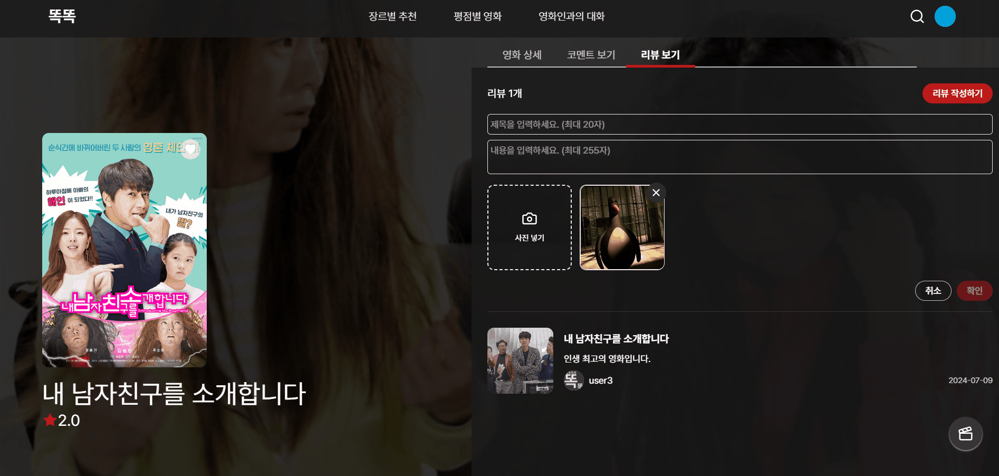
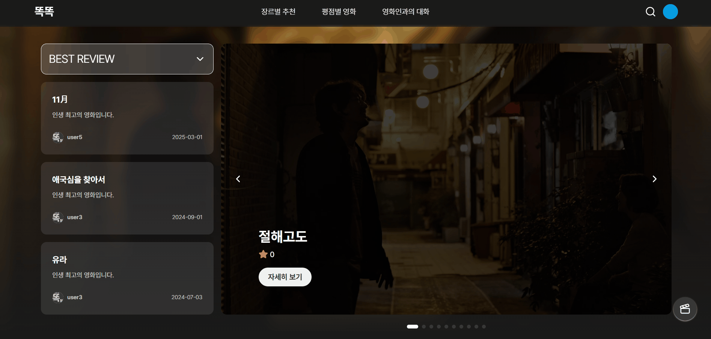

# 🎬 독립 영화 추천 서비스 - **똑똑**

> **똑똑**은 데이터 기반 분석과 AI 기술을 활용하여  
> 사용자의 영화 취향을 이해하고, 숨겨진 독립 영화를 추천하는 서비스입니다.  
> 관객과 창작자의 소통까지 아우르는 새로운 영화 경험을 제공합니다.

---

## 📅 프로젝트 기간
**2025.02.24 ~ 2025.04.11**

---

## 🌟 주요 기능

1. 🎯 **초기 맞춤 독립 영화 추천**
    - 상업 영화 선호도 분석 기반 추천
    - Konlpy + TF-IDF 기반 콜드 스타트 문제 해결
   

2. 🧠 **AI 기반 하이브리드 추천**
    - 협업 필터링 + 콘텐츠 분석을 융합한 하이브리드 추천 모델


3. 🔍 **통합 검색 및 조건별 필터링**
    - Elasticsearch 기반 영화/영화인/커뮤니티 통합 검색 시스템
   

4. 💬 **창작자와 관객의 실시간 Q&A**
    - 영화인(감독, 배우)과 사용자가 직접 소통할 수 있는 질의응답 채널 제공
   

5. 📝 **참여형 리뷰 플랫폼**
    - 사용자 블로그 형식 리뷰 작성 및 공유
    - 독립 영화 담론 형성 및 정보 교류 촉진
   

6. 🤖 **AI 챗봇 추천 시스템**
    - RAG(Retrieval-Augmented Generation) 기반 영화 추천 챗봇
    - Pinecone 벡터 DB + Gemini LLM 활용
   

---

## 🧠 기술 스택

### 🖥️ **Frontend**
<p>
  

</p>

### 🧰 **Backend**
<p>
  
  
  
</p>

### 🧠 **AI & 추천 시스템**
<p>
  
  
  
  
</p>

### 🗄️ **Database**
<p>
  
  
</p>

### 🔍 **Search**
<p>
  
</p>

### ⚙️ **Infrastructure & DevOps**
<p>
  
  
  
  
  
  
</p>

### 📄 **Documentation & Design**
<p>
  
  
  
</p>

---


## 👨‍👩‍👧‍👦 팀 구성

| 이름  | 역할            |
|-----|---------------|
| 우성윤 | 팀장, 빅데이터 & AI |
| 최지원 | 부팀장, 백엔드      |
| 권상웅 | 인프라           |
| 이효미 | 백엔드, 빅데이터     |
| 전준표 | 프론트엔드, 디자이너   |
| 서유민 | 프론트엔드, 디자이너   |

---


## 📁 프로젝트 구조

### 🧩 **Frontend: `knockknock-frontend`**

```
knockknock-frontend/
 ┣ api/          # API 호출 함수 모음
 ┣ components/   # 재사용 가능한 UI 컴포넌트
 ┣ hooks/        # 커스텀 훅
 ┣ layouts/      # 페이지 레이아웃
 ┣ pages/        # 라우트에 대응하는 페이지
 ┣ router/       # 라우터 설정
 ┣ store/        # 전역 상태 관리 (예: Recoil, Redux)
 ┣ types/        # TypeScript 타입 정의
 ┗ utils/        # 유틸리티 함수
```

---

### 🧩 **Backend: `knockknock-backend`**

```
knockknock-backend/
 ┣ controller/             # API 컨트롤러
 ┃ ┣ request/              # 요청 DTO
 ┃ ┗ response/             # 응답 DTO
 ┣ document/               # Swagger 문서 설정
 ┣ entity/                 # JPA 엔티티 클래스
 ┣ error/                  # 예외 처리
 ┃ ┣ code/                 # 에러 코드 정의
 ┃ ┗ response/             # 에러 응답 구조
 ┣ global/                 # 전역 설정
 ┃ ┣ aop/                  # AOP 처리
 ┃ ┗ config/               # 설정 클래스
 ┃   ┣ jwt/                # JWT 관련 설정
 ┃   ┗ security/           # Spring Security 설정
 ┣ repository/             # DB 접근 레이어
 ┗ service/                # 비즈니스 로직 처리
```

---


### 🧩 **AI / 알고리즘 서버: `knockknock-algorithm`**

```
knockknock-algorithm/
 ┣ api/          # 외부 API 호출
 ┣ core/         # 핵심 추천 알고리즘
 ┣ models/       # 데이터 모델 정의
 ┣ schemas/      # Pydantic 스키마
 ┣ services/     # 추천 서비스 로직
 ┣ utils/        # 공통 유틸 함수
 ┣ config.py     # 환경 설정 파일
 ┗ main.py       # FastAPI 실행 진입점
```
---

### 🧩 아키텍처


---

## 📌 프로젝트 목표 및 기대효과
### 🎯 프로젝트 목표

### ✨ 기대 효과


---

## 🚀 주요 기능 소개

### 로그인


### 메인 페이지 


### 영화 상세 페이지


### 영화 상세 페이지 댓글


### 영화 상세 페이지 리뷰


### 영화인과의 대화 페이지


### 장르 페이지


### 통합 검색


### Q&A 페이지


### 평점 페이지


---

> ✨ 더 나은 독립 영화 문화를 위한  
> **"똑똑"이 문을 두드립니다.**

---

필요하면 이 README에 배포 링크나 실행 방법, 설치 가이드도 추가해드릴 수 있어요. 어떤 식으로 활용하실 건지도 알려주시면 더 맞춤화해드릴게요!